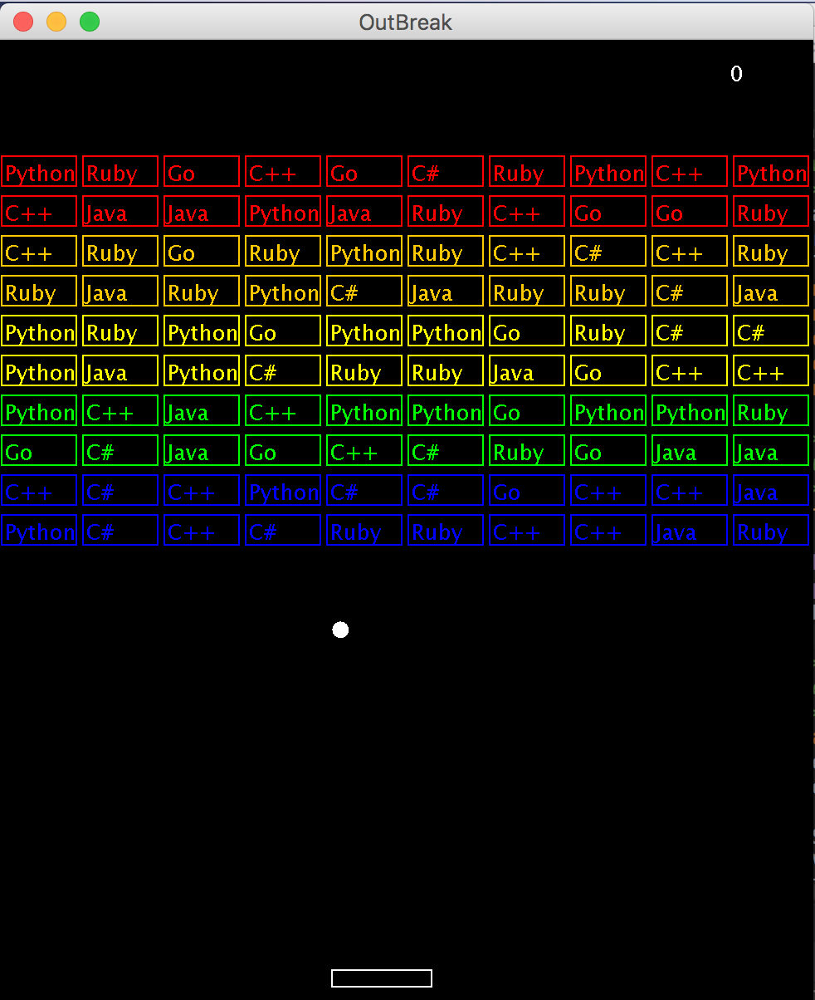
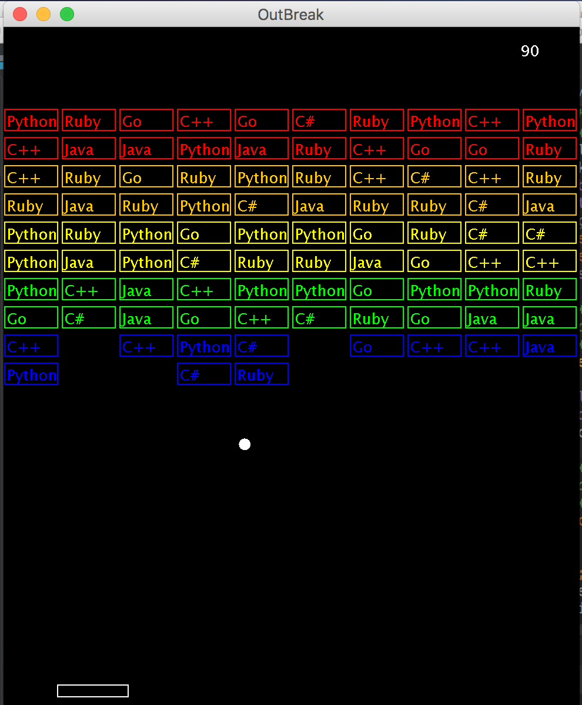

# JavaBreakout

This is a take on the old game called Breakout. I created my version for my final in my Java class (CS2000) at the University of Northern Colorado.

To run the program download it and compile it:

>
> javac src/*.java
>

Then run the main class:

>
> cd src/
>
> java OutBreak
>

A window will open with colored bricks at the top with randomized programming languages in each of the bricks.

To start the game use the mouse and click and hold the bar at the bottom and bounce the ball to hit the bricks. 

**Note:** The ball starts with random speeds.

Enjoy!